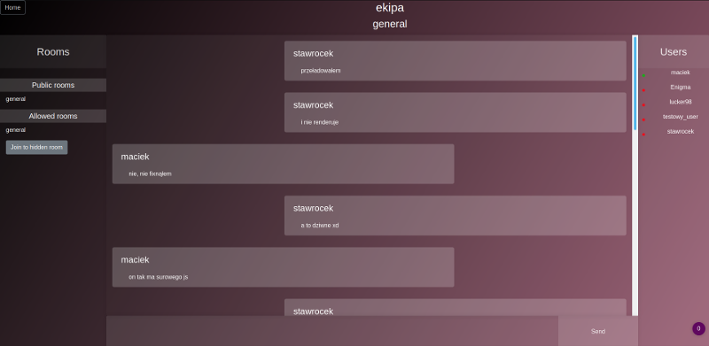
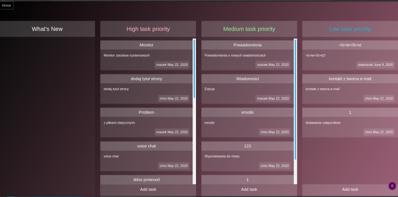

## Django Chater 
Simple group chat application written in django with trello

### Online preview
[Chat server](http://maciex.myddns.me)

### Requirements:
* Python 3.6.X
* Redis 4.X.X
* VirtualEnv(Optionaly)

### Technologies:
* django
* channels
* redis
* JWT (rest-api branch)

### Instalation
* pip3 install -r requirements.txt
* pip3 manage.py migrate
* pip3 manage.py makemigrations

### Run
* Run redis-server
* python3 manage.py runserver
